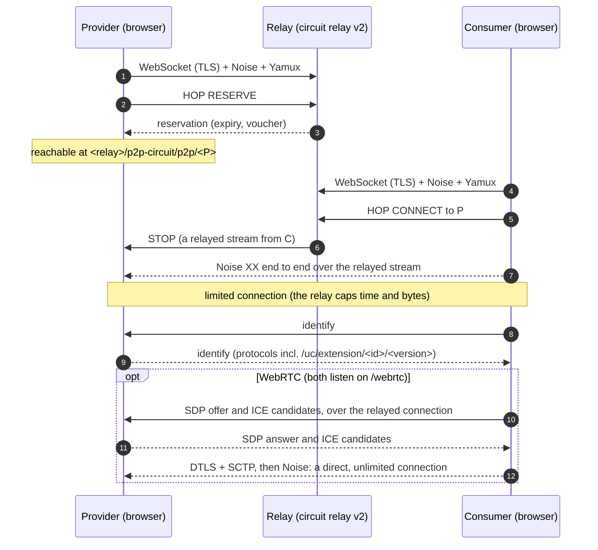
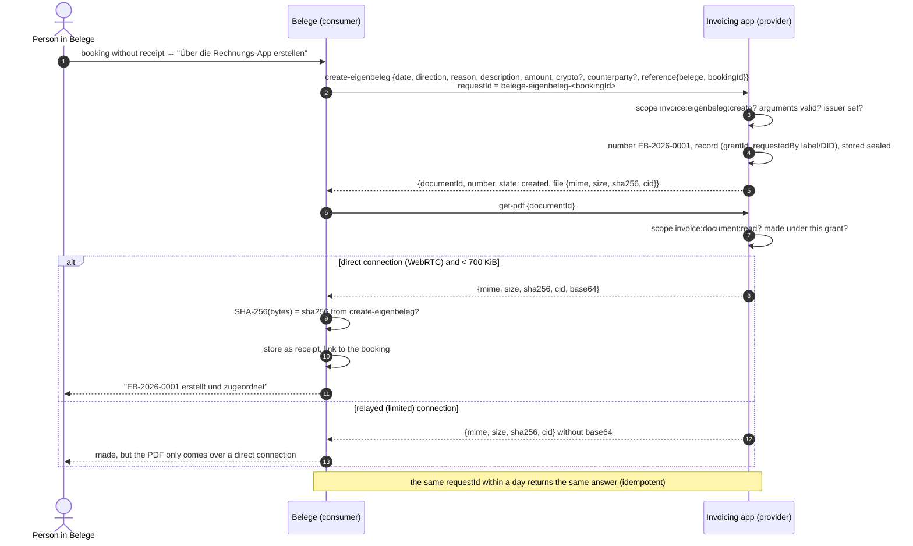
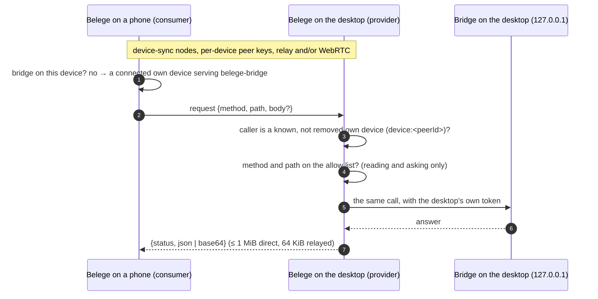

# Sequences

How UCEP runs between real peers, and the two extensions in use today. The
diagrams follow this library (`src/provider.js`, `src/consumer.js`) and the
spec ([Le-Space/ucep-spec](https://github.com/Le-Space/ucep-spec): `ucep.md`,
`ucep-auth.md`, `extensions/invoice.md`). All values are made up.

| Extension | Provider | Consumer | Pairing | Spec |
|---|---|---|---|---|
| `invoice` 0.1.0 | [Le-Space/invoice](https://github.com/Le-Space/invoice) (`app/src/lib/ucep/provider.js`) | [Le-Space/belege](https://github.com/Le-Space/belege) (`app/src/lib/ucep/consumer.js`) | invitation or in-band | `extensions/invoice.md` |
| `belege-bridge` 0.1.0 | Belege on a desktop with its bridge (`app/src/lib/sync/remote-bridge.js`) | Belege on the person's other devices | none: only devices the books know are answered | issue Le-Space/belege#142 |

## 1. Reaching each other through a relay

Two browsers cannot dial each other. Each takes a reservation on a circuit
relay; the one that dials reaches the other through it, and both try WebRTC
for a direct connection. Noise runs end to end in every case, so the relay
relays ciphertext.



The consumer reuses the connection it has. While it is only relayed, it lets
libp2p dial again at most once a minute per peer, which may come back direct
(`reusable()` in `src/consumer.js`); otherwise libp2p opened a new relayed
connection per call, and the provider refused them from the sixth a second.

## 2. Discovery: identify, never pubsub

```mermaid
sequenceDiagram
    autonumber
    participant C as Consumer
    participant P as Provider

    C->>P: dial (PeerId, multiaddr or provider link)
    P-->>C: identify: protocols
    Note over C: waits for identify until the peer store names an extension<br/>(the store holds /ipfs/id/1.0.0 before identify answers)
    C->>C: catalogue: /uc/extension/invoice/0.1.0 is online
    C->>P: Request.manifest
    P-->>C: Response.manifest (id, name, version, commands, scopes)
    Note over C: the manifest describes; it never instructs
```

## 3. Pairing with an invitation (QR code or link)

The provider's human offers scopes; whoever holds the link pairs once. The
secret never crosses the wire: the consumer proves it with an HMAC over a
transcript that binds both PeerIds, the invitation and the scopes.

```mermaid
sequenceDiagram
    autonumber
    actor H as Provider's human
    participant P as Provider
    participant C as Consumer
    actor U as Consumer's human

    H->>P: "Einladung erstellen" (scopes)
    P->>P: secret (32 random bytes), invitationId, expiry
    P-->>H: web+ucep:pair?v=1&peer=<P>&ext=invoice&inv=…&s=<secret>&exp=…&scope=…&addr=<relay circuit addr>
    H-->>U: QR code or link, out of band
    U->>C: pastes or scans it
    C->>P: dial the invitation's addresses, identify
    Note over C: only the PeerId the invitation names may answer
    C->>P: PairRequest(invitationId, scopes, label, did?, proof = HMAC-SHA256(secret, transcript))
    P->>P: check invitation (known, open, not expired), proof, scopes ⊆ offered
    alt a human confirms invitations too (confirmInvitations)
        P-->>C: PENDING (retryAfterMs), both show the same six-digit code
        H->>P: approve
        C->>P: the same PairRequest again
    end
    P-->>C: GRANTED (grantId, scopes, expiresAt)
    P->>P: invitation used; grant stored (sealed, in the apps)
    C->>C: grant stored with the provider's address
```

## 4. Pairing in-band (six-digit code)

No invitation: the provider's human opens a short window, the consumer asks,
and both screens show a code derived from a commit–reveal transcript. The
human types what the other app shows, and approves.

```mermaid
sequenceDiagram
    autonumber
    actor H as Provider's human
    participant P as Provider
    participant C as Consumer
    actor U as Consumer's human

    H->>P: "Kopplung für 2 Minuten erlauben" (pairing window)
    U->>C: provider's PeerId, "Per Code verbinden"
    C->>P: PairRequest step 1 (scopes, label, commitment = SHA-256(nonceC))
    P-->>C: PENDING (pairingId, nonceP)
    C->>P: PairRequest step 2 (pairingId, nonceC, did?, didProof?)
    P->>P: nonceC matches the commitment; transcript over both PeerIds, nonces, scopes
    P-->>H: pending pairing: label, scopes, code = SAS(transcript hash)
    C-->>U: the same code
    U-->>H: reads it out (or H compares)
    H->>P: types the code, "Zustimmen"
    C->>P: step 2 again
    P-->>C: GRANTED (grantId, scopes)
```

## 5. Extension `invoice`: an Eigenbeleg for a booking without a receipt

Belege asks the paired invoicing app for a self-issued receipt; the app
numbers it in its own range (`EB-YYYY-NNNN`), signs it off with its issuer,
and hands back the PDF, which Belege checks and files as the booking's
receipt. A grant only reads what was made under it.



Errors the app answers with: `PAIRING_REQUIRED` (no grant), `SCOPE_MISSING`,
`INVALID_ARGUMENTS` (a field, or a documentId that is unknown or another
grant's — the same answer, so nobody learns a document exists), `UNAVAILABLE`
(no issuer set up yet).

## 6. Extension `belege-bridge`: a phone uses the desktop's bridge

The bridge listens on the desktop's 127.0.0.1 only. A desktop that shares it
serves the extension on its device-sync node; the phone's calls go through
the desktop, which checks each against a fixed list and adds its own token,
which never leaves it. There is no pairing: the provider answers only peers
the books know as own devices.



## Limits that apply to every extension

- A request up to 64 KiB, an answer up to 1 MiB over a direct connection and
  64 KiB while relayed (`LIMITS` in `src/protocol.js`); 60 s to answer.
- Idempotent commands keep their result for a day per requestId.
- A provider handles at most 8 inbound streams per connection on its protocol.
